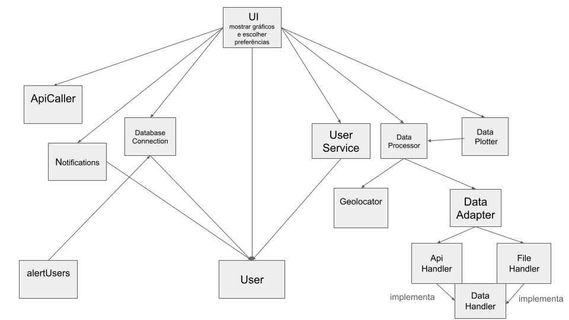

# Diagrama de Componentes

## Estilo Arquitetural

O estilo adotado neste projeto é o **Clean Code**, em que separamos em 4 frentes:

- Entities: Contém o usuário e seu Enum para verificar a situação do seu registro

- External Connections: Tudo relacionado a serviços externos (chamada da API, conexão de Banco de Dados e o módulo de enviar as notificações ao usuário)

- Frontend: Tudo relacionado à interface do usuário (templates HTML e a função main da aplicação)

- Services: Serviços pedidos pelo Frontend e o de checar as notificações de alerta pendentes de cada usuário

## Componentes principais

### ApiCaller

Responsável por fazer a chamada da API (invocado pelo ApiHandler)

### Notifications

#### EmailSender

Classe que possui um método estático de enviar um email 

### Database Connection

Utilizando SQLAlchemy, define o banco de dados relacional dos usuários e trata dos registros de novos usuários

### DataProcessor

Responsável por fornecer ao Frontend informações como temperatura, cidade atual, chuva; monta os dataframes necessários para os plots; limpa o cache do sistema

### DataAdapter

Classe de decisão que irá procurar no cache se há uma cidade já requisitada (nesse caso, invocará FileHandler); caso contrário, invocará ApiHandler para fazer uma chamada de API.

### DataPlotter

Módulo que retorna gráficos com a biblioteca Plotly e obtém os dados utilizando DataProcessor

### DataHandler

Interface (utilizando ABC do Python) para o Design Pattern adapter que força a implementação do método GetJSON

### FileHandler
Classe que implementa DataHandler e retorna um JSON disponivel no cache do sistema

### ApiHandler
Classe que implementa DataHandler e invoca ApiCaller para obter um JSON da API e escreve a resposta no cache do sistema

### Geolocator

A partir do IP, retorna a cidade atual do usuário (que posteriormente é utilizado pelo DataProcessor para retornar informações atuais do local)

### User

Classe do usuário com suas informações (Id, nome, email, senha, cidades de interesse, habilitar notificações)

### alertUsers

Script adicional para notificar os usuários com 24 horas de antecedência sobre alertas ambientais. Invoca DatabaseConnection para obter as listas de alertas de todos os usuários.
